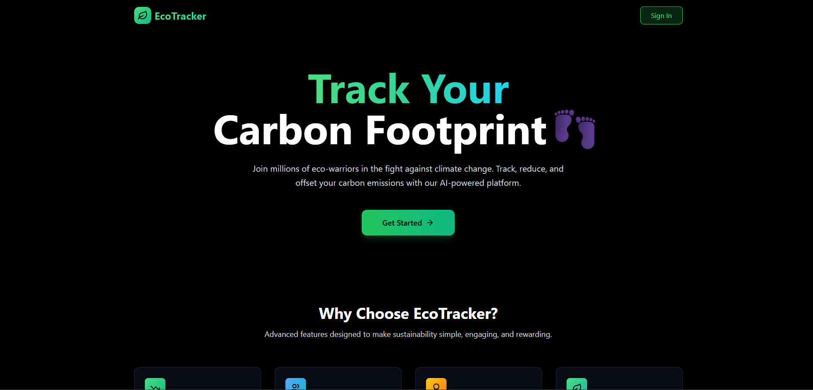

# 🌱 EcoTracker – Carbon Footprint Tracker

**EcoTracker** is a smart carbon footprint tracking web app built during the [MLH Data Hackfest](https://mlh.io). It helps users **track**, **reduce**, and **offset** their CO₂ emissions based on their **transaction data**.

(./assets/screenshot2.png)

## 🌍 About the Project

EcoTracker analyzes user transactions to estimate their carbon footprint across various categories such as:

- 🧳 Travel  
- 🍔 Food  
- ⚡ Electricity  
- 🛍️ Shopping  

It empowers users to make informed and sustainable lifestyle decisions by visualizing their environmental impact and providing actionable insights.

---

## ✨ Features

- 🔍 Transaction-based carbon footprint estimation  
- 💬 AI chatbot powered by Gemini API for sustainability tips  
- 🔐 Auth0 integration for secure user authentication  
- 📊 Intuitive dashboard with category-wise emissions breakdown  
- ⚡ Blazing-fast performance using Vite  

---

## 🛠 Tech Stack

- **Frontend:** React, TypeScript, Vite, Lucide React  
- **Authentication:** Auth0  
- **AI Integration:** Gemini API  
- **Deployment:** Vercel  

---

## 🚀 Live Demo

👉 [Try EcoTracker](https://carbo-metric-project.vercel.app/)

---

## 🧑‍💻 GitHub Repository

📂 [github.com/HertaInfinity/CarboMetricProject](https://github.com/HertaInfinity/CarboMetricProject)

---

## 🤝 Team

Built with 💚 at the MLH Data Hackfest by:

- [HertaInfinity](https://github.com/HertaInfinity)  
- Radhika Agrawal  
- Shambhavi Singh  

---

## 📜 License

This project is licensed under the MIT License.

---

## 🙌 Acknowledgments

- [Major League Hacking (MLH)](https://mlh.io)  
- [Gemini API by Google](https://deepmind.google/technologies/gemini/)  
- [Auth0](https://auth0.com)  